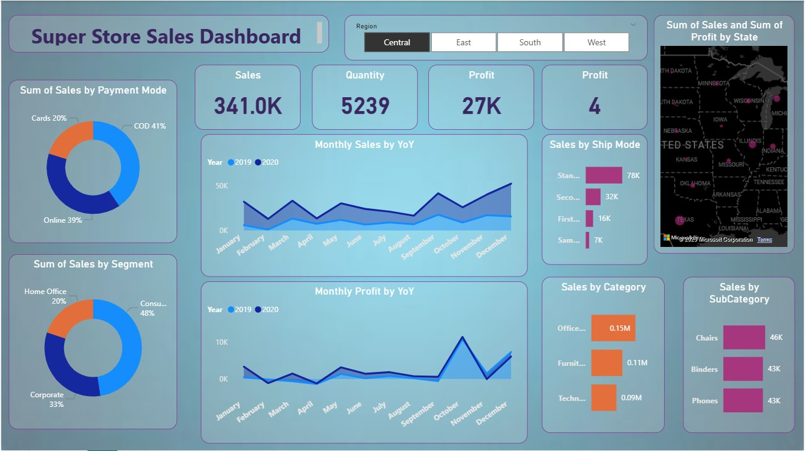

🛒 **Super Store Sales Analysis – Power BI Dashboard**

📌 **Overview**

This project analyzes Super Store Sales Data using interactive Power BI dashboards.
The goal is to uncover insights, identify growth opportunities, and help business stakeholders make data-driven decisions.

The dashboard highlights sales performance, profit trends, top-performing segments, regional insights, and forecasted sales using advanced time-series analytics.

🚀 **Key Features**

📊 Interactive Power BI Dashboard

📈 Time Series Analysis

🔮 Monthly Sales Forecasting

🌍 State & Region Wise Sales Insights

💰 Profitability & Category Analysis

💡 Dynamic Filters & Drill-downs

🧠 **Skills & Techniques Used**

-  Data Cleaning

-  Data Modeling

-  DAX Measures

-  Power Query

-  Time Series Forecasting

**Tools Used**

| Tool        | Purpose             |
| ----------- | ------------------- |
| Power BI    | BI & Dashboards     |
| Power Query | Data cleaning       |
| DAX         | Metrics calculation |
| Excel/CSV   | Dataset source      |

📷 **Dashboard Preview**

📊 **Insights Gained**
Consumer segment drives maximum sales

Office Supplies is the top-selling category

Western & Central regions perform best

Standard Shipping is most preferred

COD & Online are major payment modes

Sales and profit peak in Q4 (Oct–Dec)

Positive year-over-year growth trend
